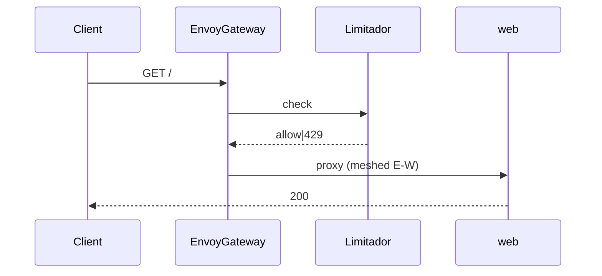
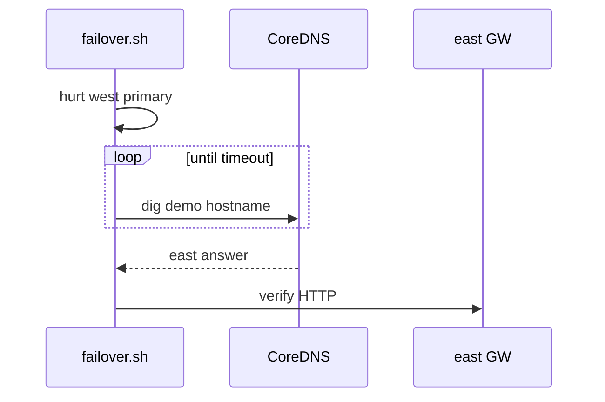

# Design: Multicluster Connectivity Demo

## Technical Approach

Greenfield `demo/` + root `Makefile` for a **30-min** laptop demo. Capability map:

| Capability | How |
|------------|-----|
| `kind-podman-lifecycle` | Prereq gate → `kind-west`/`kind-east` (1-node, Podman provider) + `podman-edge`; never `kind-cluster`; idempotent `make up`/`down` |
| `north-south-kuadrant` | EG + Kuadrant both Kind; RateLimit + CoreDNS HA; Auth API-key optional |
| `east-west-linkerd` | Linkerd both Kind; full meshed emojivoto on west; voting replica on east |
| `skupper-van` | 3-site VAN; voting west↔east; Podman `legacy-emoji` connector/listener |
| `failover-demo` | Scripted RateLimit, Skupper, DNS kill-primary + waits; runbook |

**Install order:** prereqs → Kind → EG → Kuadrant/CoreDNS → Linkerd → Skupper → apps → policies → smoke.

## Architecture Decisions

| Decision | Rejected | Choice | Why |
|----------|----------|--------|-----|
| Stack | Istio all-in; mesh-less | **EG+Kuadrant+Linkerd+Skupper+CoreDNS** | Locked; lean dual-Kind; clear planes |
| Sites | 3 Kind; reuse `kind-cluster` | **west/east/podman-edge** | Locked hybrid; never mutate unrelated |
| Mesh | Istio sidecar/Ambient | **Linkerd** | Official emojivoto; lighter CP |
| Skupper | Full app on Podman; mesh-only | **Voting cross-site + `legacy-emoji`** | Locked; one-service-out wow |
| EG↔Linkerd | Inject gateway | **Skip EG/Kuadrant NS; inject `emojivoto`** | Spec coexistence |
| DNS HA | Cloud DNS | **CoreDNS; west primary, east secondary** | No cloud; failover hurts west |
| RateLimit | Ad-hoc curl | **Tight policy + `make demo-ratelimit`** | Instant 429 |
| Auth | OIDC on path | **Optional API-key bonus** | Locked; not critical |
| Lifecycle | Ad-hoc kubectl | **`make up/down/smoke/failover/demo-*`** | Fail-fast, scoped destroy |

## Data Flow

```
Client → EG(west) → web(meshed) → voting → emoji
            │            │            │
       RateLimit(+Auth?) Linkerd   Skupper
            │                         ├─ voting(east)
       CoreDNS west→east              └─ legacy-emoji (podman)
```





## File Changes

| File | Action | Description |
|------|--------|-------------|
| `Makefile` | Create | `up`/`down`/`smoke`/`failover`/`demo-*`; allowlist |
| `README.md` | Create | Prereqs, topology, 30-min runbook, rollback |
| `demo/VERSIONS.md` | Create | Pinned CLI/chart/image versions |
| `demo/kind/{west,east}.yaml` | Create | Single-node Kind configs |
| `demo/scripts/prereq-check.sh` | Create | inotify≥512; CLIs; Podman provider |
| `demo/scripts/{up,down,smoke,failover}.sh` | Create | Ordered install; scoped destroy; probes |
| `demo/gateway/` | Create | EG values; Gateway/HTTPRoute → web |
| `demo/kuadrant/` | Create | Ops+Limitador+Authorino; RateLimit; DNSPolicy; optional Auth |
| `demo/linkerd/` | Create | Install; inject/skip annotations |
| `demo/skupper/` | Create | Sites/links; voting expose; Podman connector |
| `demo/apps/emojivoto/` | Create | West full; east voting(+deps); mesh |
| `demo/apps/legacy-emoji/` | Create | Tiny HTTP emoji JSON + Podman unit |

## Interfaces / Contracts

- Allowlist only: `kind-west`, `kind-east`, `podman-edge`. Refuse other Kind names (esp. `kind-cluster`).
- `up`: non-zero before create on prereq fail; re-run reconciles. `down`: demo sites + contexts/secrets only.
- DNS: `emojivoto.demo.local` via CoreDNS SVC. Skupper: Kind listener ↔ Podman connector for `legacy-emoji`; voting linked west↔east.
- Linkerd: skip `envoy-gateway-system` + Kuadrant CP NS; inject `emojivoto`.

## Testing Strategy

| Layer | What | Approach |
|-------|------|----------|
| Unit | N/A | No runner |
| Integration | Prereq + allowlist | Shell assertions |
| E2E | 200/429, mesh, Skupper, dig+failover | `make smoke` / `make failover` |

## Threat Matrix

Shell lifecycle destroys clusters — applies.

| Boundary | Applicability | Design response | Planned RED tests |
|---|---|---|---|
| Documentation-like paths | N/A — no exec of docs as code | — | — |
| Git / commit / push / PR | N/A — no VCS automation | — | — |
| **Cluster destroy scope** | **Applicable** | Allowlist destroy; refuse `kind-cluster`; print targets | (1) `down` leaves `kind-cluster`; (2) unknown cluster env aborts; (3) `up` never creates non-demo names |

## Migration / Rollout

No migration. Rollout `make up`; rollback `make down` (demo-only).

## Open Questions

- [x] Mesh, Skupper surface, Auth, `legacy-emoji` (≤20 LOC HTTP JSON) — decided
- [ ] Chart/image pins — fill `VERSIONS.md` at apply (non-blocking)
