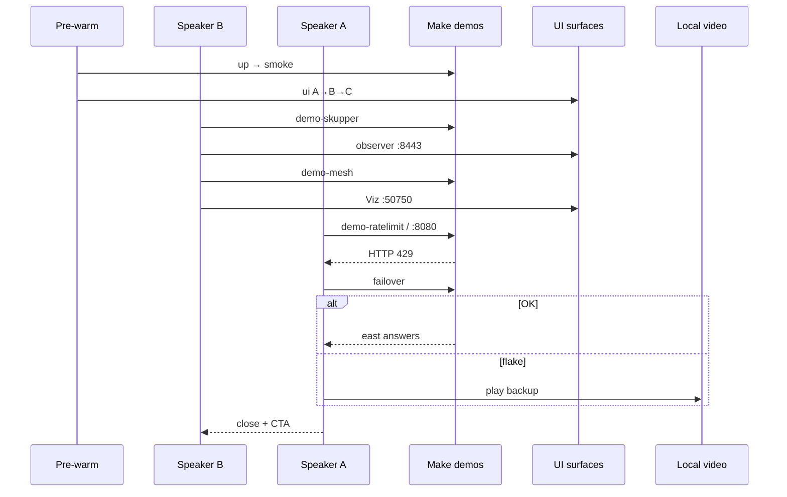

# Design: KCD BA Talk Deck

## Technical Approach

Package a **30-min dual-speaker talk** as OpenSpec text that drives the laptop demo on `main` — no stack redesign. Capability `kcd-talk-deck`: 12-slide plan, ES scripts, EN Gemini prompts, Make cues from README. Spec lives at `specs/kcd-talk-deck/spec.md` and is aligned with this design.

## Architecture — Talk Packaging

```text
IN GIT (openspec/changes/kcd-ba-talk-deck/)
  proposal.md, exploration.md, design.md, tasks.md
  specs/kcd-talk-deck/spec.md   ← sdd-spec delta
  scripts.md                    ← ES points + Make cues + rehearsal + policy
  gemini-prompts.md             ← EN 16:9 prompts
  speaker-cards.md (YES)        ← thin A/B cue cards ≤1 screen each (WU2)

OPTIONAL: README.md one-line pointer → this folder

OUTSIDE GIT
  PPTX/Keynote/visuals; failover backup video; QR/bios;
  proprietary workshop decks (never quoted); demo/.run secrets
```

Stack remains truth (`up|smoke|ui|demo-*|failover|down`). Talk artifacts reference cues only.

## Stage Run Sequence

**Pre-warm:** `prereq-check` → `up` → `smoke` → hosts → `ui` (save `ACCESS_URL`s). Never `kind-cluster`.

| Clock | Owner | Content | Cue |
|-------|-------|---------|-----|
| 0–5 | A→B | Title, who, problem, agenda | — |
| 5–9 | B | Topology + story | Diagram |
| 9–16 | B | Skupper→observer→mesh→Viz | `demo-skupper`; UI C; `demo-mesh`; UI B |
| 16–25 | A | RateLimit→failover (+app) | `demo-ratelimit`/UI A→429; `failover` |
| 25–30 | A+B | Takeaways + thanks | CTA `up`→`smoke`→optional `ui`→`down` |

Handoff: B = interconnect/mesh UIs; A = N-S + failover. Stuck demo ≤ ~2 min → contingency (skip UI / play local video / cut Option-C backup slide).

## Architecture Decisions

| Decision | Options | Tradeoff | Choice |
|----------|---------|----------|--------|
| Artifact home | `/talk` vs openspec | Disco vs SDD | **`openspec/changes/kcd-ba-talk-deck/`** |
| Binaries/video | Commit vs local | Repro vs bloat/IP | **Outside git** |
| Wording | All-ES/EN vs hybrid | Clarity | **ES body + EN tech**; Gemini EN |
| Stage cmds | YAML vs Make | Risk vs path | **Make-over-YAML** |
| UI | Skip vs live | Safety vs wow | **Pre-warm `ui`**; skip if late |
| Speakers | Flexible vs locked | Clarity | **A=Francisco, B=Sergio** |
| README | Paste vs pointer | Dup | **Optional pointer** |
| Cut order | Failover vs UI | Wow vs time | **Cut UI first** |

## Live Critical Path



## File Changes

| File | Action | Description |
|------|--------|-------------|
| `.../design.md` | Create | This design |
| `.../specs/kcd-talk-deck/spec.md` | Create | Delta (sdd-spec; align) |
| `.../scripts.md` | Create | ES + Make cues slides 1–12 + rehearsal + policy |
| `.../gemini-prompts.md` | Create | EN prompts from explore |
| `.../speaker-cards.md` | Create (YES) | Thin A/B cue cards ≤1 screen each |
| `.../tasks.md` | Create | sdd-tasks |
| `README.md` | Modify (opt) | Talk-deck pointer |
| `demo/**` | None | Cue-only |

## Interfaces / Contracts

Cues → public Make: `demo-skupper`, `demo-mesh`, `demo-ratelimit`, `failover`, `ui`/`ui-down`. URLs: `:8080`, Viz `:50750`, observer `:8443` (or printed). Never show `demo/.run` secrets on camera.

## Testing Strategy

| Layer | What | Approach |
|-------|------|----------|
| Offline | Completeness | 12 slides, owners, ES/EN, cues, prompts |
| Rehearsal | Live path | Timeboxed 429+mesh+Skupper; failover or video |
| Negative | Contingency | ≤2 min abandon + skip-UI/video |

## Threat Matrix

N/A — talk packaging; no new routing/shell/VCS/process boundaries.

## Migration / Rollout

No migration. Delivery **ask-on-risk**. Rollback = revert change folder; stage = video / skip UI.

## Apply Implications (sdd-tasks)

1. Write `scripts.md` + `gemini-prompts.md` (locked speakers).
2. Create `speaker-cards.md` (locked YES, thin ≤1 screen each); optional README pointer (WU2).
3. No PPTX/video in git; document outside-git contingency in `scripts.md`.
4. Aligned with `specs/kcd-talk-deck`; delivery ask-on-risk + feature-branch-chain (WU1 → WU2).

## Open Questions

- [x] Spec alignment — `specs/kcd-talk-deck/spec.md` present and aligned (speakers A=Francisco / B=Sergio, timing blocks, UI A→B→C, failover live + outside-git video, hybrid ES+EN, never `kind-cluster`).
- [x] `speaker-cards.md` = **YES** — thin A/B cue cards ≤1 screen each (materialize in WU2 / PR2; cues remain authoritative in `scripts.md`).
